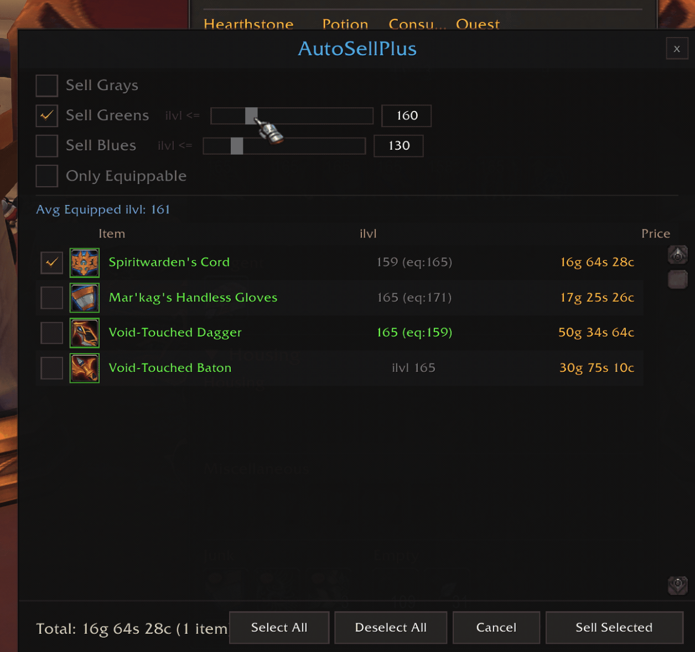

<a id="readme-top"></a>

<br>

<p align="center">
  
</p>

<h1 align="center">AutoSellPlus</h1>

<p align="center">
  <b>Mass-sell low item level greens and blues in one click.</b><br>
  <sub>A World of Warcraft addon</sub>
</p>

<p align="center">
  <a href="#-features">Features</a> &middot;
  <a href="#-getting-started">Getting Started</a> &middot;
  <a href="#-commands">Commands</a> &middot;
  <a href="#-configuration">Configuration</a> &middot;
  <a href="#-development">Development</a> &middot;
  <a href="#-releasing">Releasing</a>
</p>

<p align="center">
  
  &nbsp;
  
  &nbsp;
  
</p>

<br>

<p align="center">
  
</p>

<p align="center">
  
</p>

<br>

<p align="center">
  AutoSellPlus pops up the moment you open a merchant and lays out every green and blue<br>
  below your gear level, pre-checked and ready to vendor. It knows what you're wearing,<br>
  protects upgrades and uncollected transmog, and sets ilvl thresholds automatically.
</p>

<h3 align="center">No setup. No accidents. Just gold.</h3>

<br>

---

<br>

## &nbsp; Features

| | |
| :--- | :--- |
| **Instant merchant popup** | Every vendorable item laid out the moment you talk to a vendor |
| **Smart auto-select** | Grays, greens, and blues below your equipped ilvl are pre-checked |
| **Upgrade protection** | Never sells upgrades, equipment sets, uncollected transmog, or refundables |
| **Auto ilvl thresholds** | Adapts to your gear automatically, no manual config needed |
| **Full control** | One click to sell, Escape to cancel, uncheck anything you want to keep |

<br>

## &nbsp; Getting Started

### Installation

Drop the `AutoSellPlus` folder into your addons directory:

```
World of Warcraft/_retail_/Interface/AddOns/AutoSellPlus/
```

Or run the install script on macOS:

```bash
./install.sh
```

### Usage

1. Visit any merchant
2. AutoSellPlus popup appears with your junk pre-selected
3. Review, uncheck anything you want to keep
4. Hit **Sell Selected**

<br>

## &nbsp; Commands

| Command | Description |
| :--- | :--- |
| `/asp` | Show help |
| `/asp toggle` | Enable / disable |
| `/asp dryrun` | Preview mode, nothing gets sold |
| `/asp config` | Open settings panel |
| `/asp add <id>` | Never sell this item |
| `/asp remove <id>` | Remove from never-sell list |
| `/asp list` | Show never-sell and always-sell lists |

> [!TIP]
> `/autosell` works as an alias for `/asp`

<br>

## &nbsp; Configuration

Open with `/asp config` or **Options > AddOns > AutoSellPlus**.

| Category | Options |
| :--- | :--- |
| **Safety** | Protect equipment sets, protect uncollected transmog |
| **Output** | Sale summary, itemized log, dry run mode, buyback warning |

Filter controls (sell grays / greens / blues, ilvl sliders, equippable-only toggle) live directly on the popup and persist between sessions.

<br>

---

<br>

## &nbsp; Development

> [!NOTE]
> See [CONTRIBUTING.md](CONTRIBUTING.md) for guidelines on submitting changes.

### Project Structure

```
AutoSellPlus/
├── AutoSellPlus/            # Addon source
│   ├── AutoSellPlus.toc     # Table of contents (loaded by WoW)
│   ├── Config.lua           # Defaults and saved variables
│   ├── Helpers.lua          # Utility functions (ilvl, transmog, formatting)
│   ├── UI.lua               # Settings panel (Options > AddOns)
│   ├── Popup.lua            # Main merchant popup frame
│   └── Core.lua             # Sell logic, slash commands, event handling
├── assets/                  # Images for README (excluded from package)
├── .pkgmeta                 # BigWigsMods packager config
├── .luacheckrc              # Luacheck linting rules
├── install.sh               # macOS install script
└── .github/workflows/       # CI/CD pipeline
```

### Local Testing

Symlink the addon into your WoW addons folder:

```bash
./install.sh
```

Or manually copy `AutoSellPlus/` to:

```
World of Warcraft/_retail_/Interface/AddOns/AutoSellPlus/
```

Reload the UI in-game with `/reload`.

### Linting

Run [luacheck](https://github.com/mpeterv/luacheck) locally before pushing:

```bash
luacheck AutoSellPlus/
```

The CI pipeline runs luacheck automatically on every push.

<br>

## &nbsp; Releasing

Releases are fully automated via GitHub Actions using [BigWigsMods/packager](https://github.com/BigWigsMods/packager).

### How to Release

1. Tag the commit and push:
   ```bash
   git tag v1.2.3
   git push origin v1.2.3
   ```
2. The pipeline will automatically:
   - Run luacheck
   - Package the addon (respecting `.pkgmeta` ignores)
   - Upload to [CurseForge](https://www.curseforge.com/wow/addons) and [Wago](https://addons.wago.io)
   - Create a GitHub release with the zip attached

### Required Secrets

Set these in **GitHub > Settings > Secrets and variables > Actions**:

| Secret | Source |
| :--- | :--- |
| `CF_API_KEY` | [CurseForge API tokens](https://authors.curseforge.com) |
| `WAGO_API_TOKEN` | [Wago developer settings](https://addons.wago.io) |

> [!IMPORTANT]
> `GITHUB_TOKEN` is provided automatically. Make sure **Settings > Actions > General > Workflow permissions** is set to **Read and write**.

### Version Token

The `.toc` file uses `@project-version@` which the packager replaces with the git tag at build time. Do not hardcode a version number.

<br>

---

<br>

<p align="center">
  Made by <a href="https://cloudsail.com">Cloudsail Digital Solutions</a>
</p>
